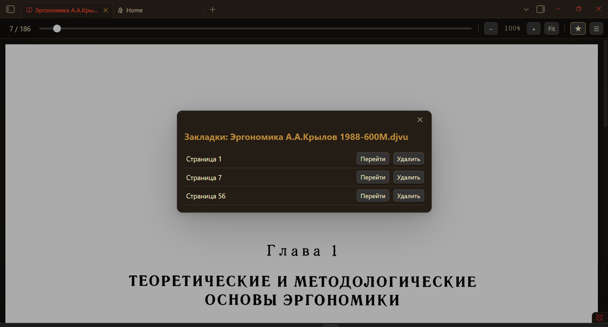

[Русский](README.ru.md) | **English**

# DjVu Reader for Obsidian

Read `.djvu` / `.djv` files directly inside Obsidian — page by page, with zoom — using a **local** DjVuLibre decoder. Fully offline: nothing is ever sent over the network.

## Requirements

- **Obsidian** (desktop only — the plugin shells out to a local binary).
- **DjVuLibre** installed on your machine (provides `ddjvu` / `djvused`).
  - Windows installer / sources: <https://djvu.sourceforge.net/>
  - Linux: `sudo apt install djvulibre-bin` (Debian/Ubuntu) or the equivalent for your distro.
  - macOS: `brew install djvulibre`

> The decoder is external and local by design. A future **v2** is planned to bundle the decoder as WebAssembly so that no separate install is needed.

## Installation

**Via BRAT (recommended):** add this repository URL in the BRAT plugin → it will install and update the plugin from GitHub releases.

**Manual:** copy the plugin folder into `<vault>/.obsidian/plugins/djvu-reader/`, then enable it in *Settings → Community plugins*.

After enabling, open *Settings → DjVu Reader* and press **Detect now** (or paste the DjVuLibre folder path if auto-detection fails).

## Usage

- Click any `.djvu` file in the file tree — it opens in the reader view.
- **Navigation:** the mouse wheel and `↑`/`↓`/`PgUp`/`PgDn`/`Space` scroll the page and flip pages at the top/bottom edge; `←`/`→`/`Home`/`End` jump pages directly; the **slider** scrubs through pages (drag to preview the number, release to jump). Click the page counter to type a page number.
- `−` / `+` — zoom out / in; **Fit** — fit to width; **Ctrl/⌘ + mouse wheel** over the page — smooth zoom.
- Zoom level persists across pages; corrupt pages (e.g. from data-recovery tools) are shown as an inline notice while the rest of the book keeps working.

## How it works

1. The plugin registers a custom view for the `.djvu`/`.djv` extensions and intercepts file opening.
2. `djvused -e n` returns the page count.
3. `ddjvu -format=ppm -page=N -size=WxH` renders one page to a raw PPM image.
4. A **built-in, dependency-free PPM→PNG converter** (pure Node `zlib`) turns the raster into a PNG data-URL the browser can display.
5. Zoom is done in CSS over a high-resolution render, so it stays sharp at working zoom levels and responds instantly.

## Limitations

- Pages are rendered as **raster images** — there is no selectable / searchable text layer (DjVu text layers are not extracted).
- Heavily corrupted files may fail per-page; this is a property of the file, not the plugin.

## Roadmap

- **v2:** bundle DjVuLibre as WebAssembly → one-click install, no external binary.
- Keyboard navigation (`←`/`→`, `+`/`−`), drag-to-pan while zoomed.

## License

MIT — see [LICENSE](LICENSE).