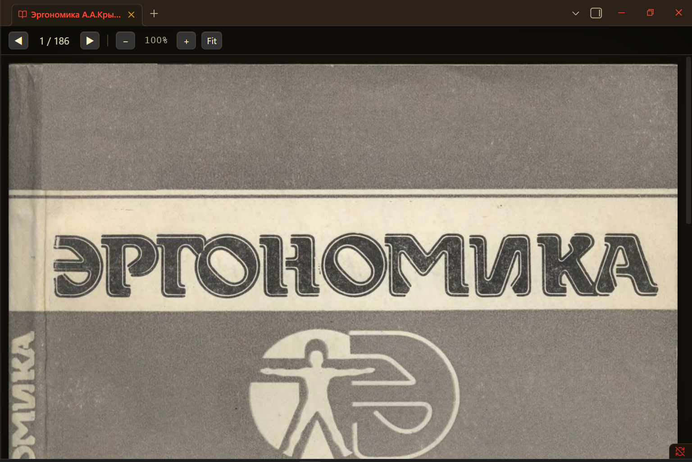

**Русский** | [English](README.md)

# DjVu Reader для Obsidian

Читайте файлы `.djvu` / `.djv` прямо в Obsidian — постранично, с масштабом — через **локальный** декодер DjVuLibre. Полностью оффлайн: в сеть ничего не уходит.

## Требования

- **Obsidian** (только десктоп — плагин вызывает локальную программу).
- **DjVuLibre** на компьютере (даёт `ddjvu` / `djvused`).
  - Windows: <https://djvu.sourceforge.net/>
  - Linux: `sudo apt install djvulibre-bin` (Debian/Ubuntu) или аналог вашего дистрибутива.
  - macOS: `brew install djvulibre`

> Декодер внешний и локальный по замыслу. В **v2** планируется встроить декодер как WebAssembly, чтобы ничего отдельно ставить не пришлось.

## Установка

**Через BRAT (рекомендуется):** добавьте URL этого репозитория в плагин BRAT — он установит плагин и будет обновлять его из GitHub-релизов.

**Вручную:** скопируйте папку плагина в `<vault>/.obsidian/plugins/djvu-reader/`, затем включите в *Настройки → Сторонние плагины*.

После включения откройте *Настройки → DjVu Reader* и нажмите **Найти декодер** (или вставьте путь к папке DjVuLibre, если автопоиск не сработал).

## Использование

- Клик по `.djvu` в дереве файлов — книга откроется в читалке.
- `◀` / `▶` — предыдущая / следующая страница.
- `−` / `+` — масштаб; **Fit** — вписать по ширине; **Ctrl/⌘ + колесо** над страницей — плавный зум.
- Масштаб сохраняется между страницами; повреждённые страницы (например, после программ восстановления данных) показываются заметкой внутри страницы, остальная книга продолжает листаться.

## Как это работает

1. Плагин регистрирует собственное представление для расширений `.djvu`/`.djv` и перехватывает открытие файла.
2. `djvused -e n` возвращает число страниц.
3. `ddjvu -format=ppm -page=N -size=WxH` рендерит одну страницу в сырой PPM.
4. **Встроенный конвертер PPM→PNG без зависимостей** (чистый Node `zlib`) превращает растр в PNG, который понимает браузер.
5. Масштаб делается в CSS поверх рендера высокого разрешения — поэтому на рабочих значениях чётко и откликается мгновенно.

## Ограничения

- Страницы рендерятся как **растр** — выделяемого / искомого текстового слоя нет (текстовые слои DjVu не извлекаются).
- Сильно повреждённые файлы могут не рендериться постранично — это свойство файла, не плагина.

## Планы

- **v2:** встроить DjVuLibre как WebAssembly → установка в один клик, без внешней программы.
- Навигация с клавиатуры (`←`/`→`, `+`/`−`), перетаскивание страницы при зуме.

## Лицензия

MIT — см. [LICENSE](LICENSE).